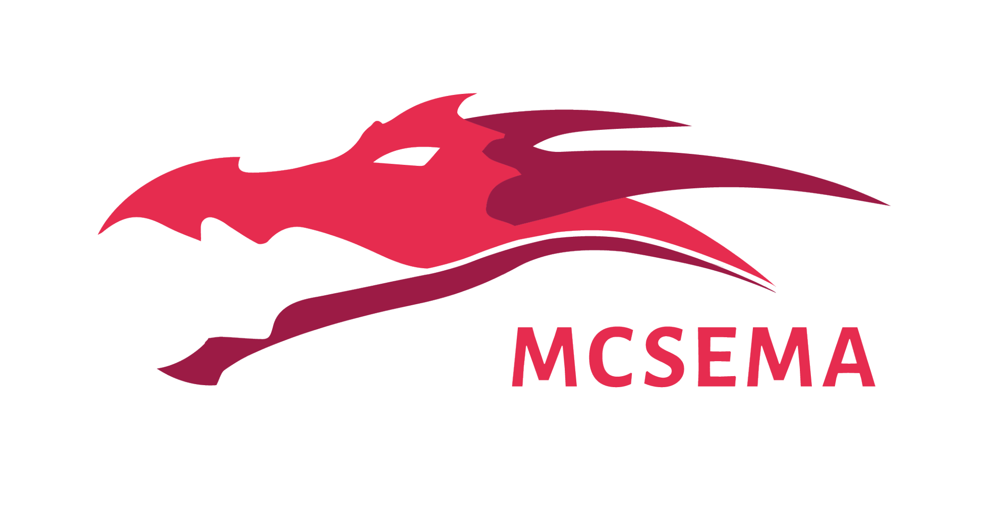

# McSema [](https://empireslacking.herokuapp.com/)
<p align="center">
     
</p>

McSema is an executable lifter. It translates ("lifts") executable binaries from native machine code to LLVM bitcode. LLVM bitcode is an [intermediate representation](https://en.wikipedia.org/wiki/Intermediate_representation) form of a program that was originally created for the [retargetable LLVM compiler](https://llvm.org), but which is also very useful for performing program analysis methods that would not be possible to perform on an executable binary directly.

McSema enables analysts to find and retroactively harden binary programs against security bugs, independently validate vendor source code, and generate application tests with high code coverage. McSema isn’t just for static analysis. The lifted LLVM bitcode can also be [fuzzed with libFuzzer](https://github.com/lifting-bits/mcsema/blob/master/docs/UsingLibFuzzer.md), an LLVM-based instrumented fuzzer that would otherwise require the target source code. The lifted bitcode can even be [compiled](https://github.com/lifting-bits/mcsema/blob/master/docs/UsingLibFuzzer.md) back into a [runnable program](https://github.com/lifting-bits/mcsema/blob/master/docs/McSemaWalkthrough.md)! This is a procedure known as static binary rewriting, binary translation, or binary recompilation.

McSema supports lifting both Linux (ELF) and Windows (PE) executables, and understands most x86 and amd64 instructions, including integer, X87, MMX, SSE and AVX operations. AARCH64 (ARMv8) instruction support is in active development.

Using McSema is a two-step process: control flow recovery, and instruction translation. Control flow recovery is performed using the `mcsema-disass` tool, which relies on IDA Pro to disassemble a binary file and produce a control flow graph. Instruction translation is then performed using the `mcsema-lift` tool, which converts the control flow graph into LLVM bitcode. Under the hood, the instruction translation capability of `mcsema-lift` is implemented in the [`remill` library](https://github.com/lifting-bits/remill). The development of `remill` was a result of refactoring and improvements to McSema, and was first introduced with McSema version 2.0.0. Read more about `remill` [here](https://github.com/lifting-bits/remill).

McSema and `remill` were developed and are maintained by Trail of Bits, funded by and used in research for DARPA and the US Department of Defense.

## Build status

|       | master                                   |
| ----- | ---------------------------------------- |
| Linux | [](https://github.com/lifting-bits/mcsema/actions?query=workflow%3ACI) |

## Features

* Lifts 32- and 64-bit Linux ELF and Windows PE binaries to bitcode, including executables and shared libraries for each platform.
* Supports a large subset of x86 and x86-64 instructions, including most integer, X87, MMX, SSE, and AVX operations.
* Supports a large subset of AArch64, SPARCv8+ (SPARC32), and SPARCv9 (SPARC64) instuctions.
* McSema runs on Windows and Linux and has been tested on Windows 7, 10, Ubuntu (14.04, 16.04, 18.04), and openSUSE.
* McSema can cross-lift: it can translate Linux binaries on Windows, or Windows binaries on Linux.
* Output bitcode is compatible with the LLVM toolchain (versions 3.5 and up).
* Translated bitcode can be analyzed or [recompiled as a new, working executable](docs/McSemaWalkthrough.md) with functionality identical to the original.

## Use-cases

Why would anyone translate binaries *back* to bitcode?

* **Binary Patching And Modification**. Lifting to LLVM IR lets you cleanly modify the target program. You can run obfuscation or hardening passes, add features, remove features, rewrite features, or even fix that pesky typo, grammatical error, or insane logic. When done, your new creation can be recompiled to a new binary sporting all those changes. In the [Cyber Grand Challenge](https://blog.trailofbits.com/2015/07/15/how-we-fared-in-the-cyber-grand-challenge/), we were able to use McSema to translate challenge binaries to bitcode, insert memory safety checks, and then re-emit working binaries.

* **Symbolic Execution with KLEE**. [KLEE](https://klee.github.io/) operates on LLVM bitcode, usually generated by providing source to the LLVM toolchain. McSema can lift a binary to LLVM bitcode, [permitting KLEE to operate on previously unavailable targets](https://blog.trailofbits.com/2014/12/04/close-encounters-with-symbolic-execution-part-2/). See our [walkthrough](examples/Maze/README.md) showing how to run KLEE on a symbolic maze.

* **Re-use existing LLVM-based tools**. KLEE is not the only tool that becomes available for use on bitcode. It is possible to run LLVM optimization passes and other LLVM-based tools like [libFuzzer](http://llvm.org/docs/LibFuzzer.html) on [lifted bitcode](docs/UsingLibFuzzer.md).

* **Analyze the binary rather than the source**. Source level analysis is great but not always possible (e.g. you don't have the source) and, even when it is available, it lacks compiler transformations, re-ordering, and optimizations. Analyzing the actual binary guarantees that you're analyzing the true executed behavior.

* **Write one set of analysis tools**. Lifting to LLVM IR means that one set of analysis tools can work on both the source and the binary. Maintaining a single set of tools saves development time and effort, and allows for a single set of better tools.

## Comparison with other machine code to LLVM bitcode lifters
|   | McSema | [dagger](https://github.com/repzret/dagger) | [llvm-mctoll](https://github.com/Microsoft/llvm-mctoll) | [retdec](https://github.com/avast-tl/retdec) | [reopt](https://github.com/GaloisInc/reopt) | [rev.ng](https://github.com/revng/revamb) | [bin2llvm](https://github.com/cojocar/bin2llvm) | [fcd](https://github.com/zneak/fcd) | [RevGen](https://github.com/S2E/tools/tree/master/tools) | [Fracture](https://github.com/draperlaboratory/fracture) | [libbeauty](https://github.com/pgoodman/libbeauty) |
|  ------ | ------ | ------ | ------ | ------ | ------ | ------ | ------ | ------ | ------ | ------ | ------ |
|  Actively maintained? | Yes | No | Yes | Yes | Yes | No | Maybe | Maybe | Maybe | No | Yes |
|  Commercial support available? | Yes | No | No | No | Maybe | No | No | No | No | Maybe | No |
|  LLVM versions | 3.5 - current | 5 | current | 4.0 | 3.8 | 3.8 | 3.2 | 4 | 3.9 | 3.4 | 6 |
|  Builds with CI? | Yes | No | No | Yes | No | No | Yes | Maybe | Maybe | No | No |
|  32-bit architectures | x86, SPARC32 | x86 | ARM | x86, ARM, MIPS, PIC32, PowerPC |  | ARM, MIPS | S2E | S2E | S2E | ARM, x86 |  |
|  64-bit architectures | x86-64, AArch64, SPARC64 | x86-64, [AArch64](https://github.com/IAIK/ios-analysis-dagger/)) | x86-64 | x86-64, arm64 & more | x86-64 | x86-64 |  | S2E | S2E | PowerPC | x86-64 |
|  Control-flow recovery | IDA Pro | Ad-hoc | Ad-hoc | Ad-hoc | Ad-hoc | Ad-hoc | Ad-hoc | Ad-hoc | McSema | Ad-hoc | Ad-hoc |
|  File formats | ELF, PE | ELF, Mach-O |  | ELF, PE, Mach-O, COFF, AR, Intel HEX, Raw | ELF | ELF | ELF |  | ELF, PE | ELF, Mach-O (maybe) | ELF |
|  Bitcode is executable? | Yes | Yes | Yes | Yes | Yes | Yes | No | No | CGC | No | No |
|  C++ exceptions suport? | Yes | No | No | No | No | Indirectly | No | No | No | No | Maybe |
|  Lifts stack variables? | Yes | No | Maybe | Yes | No | No | No | Yes | No | No | Maybe |
|  Lifts global variables? | Yes | Maybe | Yes | Yes | No | Maybe | No | No | No | Yes | Maybe |
|  Has a test suite? | Yes | No | Yes | Yes | Yes | Yes | Yes | Yes | No | Yes | No |

**Note:** We label some architectures as "S2E" to mean any architecture supported by the S2E system. A system using "McSema" for control-flow recovery (e.g. RevGen) uses McSema's CFG.proto format for recovering control-flow. In the case of RevGen, only bitcode produced from DARPA Cyber Grand Challenge (CGC) binaries is executable.

## Dependencies

| Name | Version | 
| ---- | ------- |
| [Git](https://git-scm.com/) | Latest |
| [CMake](https://cmake.org/) | 3.2+ |
| [Remill](https://github.com/lifting-bits/remill) | Latest |
| [Anvill](https://github.com/lifting-bits/anvill) | Latest |
| [Python](https://www.python.org/) | 2.7, 3.8 | 
| [Python Package Index](https://pypi.python.org/pypi) | Latest |
| [python-protobuf](https://pypi.python.org/pypi/protobuf) | 3.2.0 |
| [python-clang](https://pypi.org/project/clang/) | 3.5.0 |
| [ccsyspath](https://pypi.org/project/ccsyspath/) | 1.1.0 |
| [IDA Pro](https://www.hex-rays.com/products/ida) | 7.5+ |
| macOS | Latest |
| Ubuntu | 18.04, 20.04 |

* DynInst support is optional if you use the experimental DynInst disassembler. Note: We do not provide support for the DynInst disassembler.

## Getting and building the code

### Docker

#### Step 1: Clone the repository

```bash
git clone https://github.com/lifting-bits/mcsema
cd mcsema
```

#### Step 2: Add your disassembler to the Dockerfile

Currently IDA is the only supported frontend for control-flow recovery, it's left as an exercise to the reader to install your disassembler of choice. Experimental support for DynInst is available but may be buggy and sometimes get out of date, as we do not officially support it. DynInst support is provided as an exemplar of how to make a third-party disassembler.

#### Step 3: Build & Run Dockerfile

This will build the container for you and run it with your local directory mounted into the container (at `/mcsema/local`) such that your work in the container is saved locally:

```sh
# Build McSema container
ARCH=amd64; UBUNTU=18.04; LLVM=800; docker build . \
  -t mcsema:llvm${LLVM}-ubuntu${UBUNTU}-${ARCH} \
  -f Dockerfile \
  --build-arg UBUNTU_VERSION=${UBUNTU} \
  --build-arg LLVM_VERSION=${LLVM} \
  --build-arg ARCH=${ARCH}

# Run McSema container lifter
docker run --rm -it --ipc=host -v "$(pwd)":/mcsema/local mcsema:llvm${LLVM}-ubuntu{$UBUNTU}-${ARCH}

# Run McSema container disassembler
docker run --rm -it --entrypoint=mcsema-disass --ipc=host -v "$(pwd)":/mcsema/local mcsema:llvm${LLVM}-ubuntu{$UBUNTU}-${ARCH}
```

### Native Build

#### Linux pre-requisites

Native builds on Linux are supported for Ubuntu 18.04 and 20.04. We only support
LTS Ubuntu releases.

```shell
sudo apt-get update
sudo apt-get upgrade

sudo apt-get install \
     git \
     curl \
     cmake \
     python2.7 python-pip python-virtualenv \
     wget \
     build-essential \
     gcc-multilib g++-multilib \
     libtinfo-dev \
     lsb-release \
     zip \
     zlib1g-dev \
     ccache
```

##### Ubuntu 14.04 and Ubuntu 16.04

```bash
sudo apt-get install realpath
```

##### Ubuntu 18.04

```bash
sudo apt-get install -qqy --no-install-recommends libtinfo5
```

##### Ubuntu 20.04

```bash
sudo apt-get install -qqy --no-install-recommends libtinfo6
```

#### macOS pre-requisites

Download and install the [Homebrew](https://brew.sh) package manager.

Make sure to download XCode from the App Store if you don't have it. After
downloading XCode, make sure to open it at least once, as it might install
more stuff.

```bash
brew update
xcode-select --install 2>&1 > /dev/null
sudo xcode-select --switch /Applications/Xcode.app/Contents/Developer
brew install coreutils ccache
pip3 install requests
```

Double check that you have the correct Clang installed. You should see something like this:

```bash
% clang -v
Apple clang version 12.0.0 (clang-1200.0.32.21)
Target: x86_64-apple-darwin19.6.0
Thread model: posix
InstalledDir: /Applications/Xcode.app/Contents/Developer/Toolchains/XcodeDefault.xctoolchain/usr/bin
```

#### Step 1 (Optional): Create a virtualenv for your McSema installation

Using a [virtualenv](https://virtualenv.pypa.io/en/stable/) ensures that your McSema installation does not interfere with other software packages. This setup is especially helpful if you are hacking on McSema and want to avoid clobbering a global, working version with development code.

```shell
mkdir mcsema-ve
virtualenv mcsema-ve
cd mcsema-ve
source bin/activate
```

#### Step 2: Clone the repository and its dependencies

```shell
git clone --depth 1 --single-branch --branch master https://github.com/lifting-bits/remill.git
git clone --depth 1 --single-branch --branch master https://github.com/lifting-bits/anvill.git
git clone --depth 1 --single-branch --branch master https://github.com/lifting-bits/mcsema.git

if [ -z "${VIRTUAL_ENV}" ]
then
  # no virtualenv; global install for all users requires sudo
  function make_install { ;  sudo make install ; }
else
  # found a virtualenv; local install does not need root
  function make_install { ;  make install ; }
fi

# Download cxx-common, build Remill. 
./remill/scripts/build.sh --llvm-version 9.0
cd remill-build
make install

export TRAILOFBITS_LIBRARIES=`pwd`/remill-build/libraries

# Build and install Anvill
mkdir anvill-build
pushd anvill-build
${TRAILOFBITS_LIBRARIES}/cmake/bin/cmake ../anvill
make
make install
popd

# Build and install McSema
mkdir mcsema-build
pushd mcsema-build
${TRAILOFBITS_LIBRARIES}/cmake/bin/cmake ../mcsema
make
make install
popd
```

Once installed, you may use `mcsema-disass` for disassembling binaries, and `mcsema-lift-4.0` for lifting the disassembled binaries. If you specified `--llvm-version 3.6` to the `build.sh` script, then you would use `mcsema-lift-3.6`.

#### Step 3: Verifying Your McSema Installation

Step 2 specified `--llvm-version 9.0` to Remill's `build.sh` script. This means
that Remill, Anvill, and McSema have all been built against a copy of LLVM 9.0.
To enable you to use multiple LLVM versions simultaneously, we suffix our binaries
with the LLVM version. Thus, you may use `mcsema-lift-9.0` to lift to LLVM 9.0 bitcode.

Try running `mcsema-lift-9.0 --version` to see if McSema has been installed.

##### Run the integration tests

In order to verify that McSema works correctly as built, head on over to [the documentation on integration tests](tests/MakingTests.md). Check that you can run the tests and that they pass.

### On Windows (Experimental, may not work)

#### Step 1: Installing the toolchain
**Visual Studio**
1. Click on "Tools for Visual Studio 2019" and download the "Build Tools for Visual Studio 2019" installer from the [Visual Studio downloads page](https://visualstudio.microsoft.com/downloads/)
2. Select "MSVC v142 - VS 2019 C++ x64/x86 build tools" and confirm the installation

**LLVM**
1. Get the LLVM 9 (x64) installer from the LLVM download page: http://releases.llvm.org
2. Do **NOT** enable "Add to PATH"

**Python**
1. Get the latest Python 2.7 (X64) installer from the official download page: https://www.python.org/downloads/windows/
2. Enable "Add to PATH"

**CMake**
1. Download the CMake (x64) installer from https://cmake.org/download
2. Enable "Add to PATH"

#### Step 2: Obtaining the source code
```
git clone https://github.com/lifting-bits/remill.git --depth=1
git clone https://github.com/lifting-bits/mcsema.git --depth=1 remill/tools/mcsema
```

Note that for production usage you should always use a specific remill commit (`remill/tools/mcsema/.remill_commit_id`) when building McSema. At the time of writing, it is however best to use HEAD (or at least make sure that commit `e7795be` is present in the remill branch).

```
cd remill
git fetch --unshallow
git checkout -b production <commit>
```

#### Step 3: Enabling the LLVM toolchain for Visual Studio

Download the official extension from the market place: https://marketplace.visualstudio.com/items?itemName=LLVMExtensions.llvm-toolchain

##### Automatic installation

Only works for the full Visual Studio IDE. Double clicking the extension should automatically install it.

##### Manual installation

The extension is in fact a ZIP archive; extract it and copy the VCTargets folder to the right location.

* Full Visual Studio: `C:\Program Files (x86)\Microsoft Visual Studio\2019\BuildTools\Common7\IDE\VC\VCTargets`
* Visual Studio Build Tools: `C:\Program Files (x86)\Microsoft Visual Studio\2019\BuildTools\MSBuild\Microsoft\VC\v160`

#### Step 4: Dependencies

Its time to fetch library dependencies. You can either build them yourself using our [cxx-common](https://github.com/trailofbits/cxx-common) dependency manager or download a pre-built package.

There are two versions of LLVM used by Remill and McSema. One version (currently 7.0.1) builds remill and McSema. Another version (currently 5.0.1) is used to build the translation semantics.

On Windows, only the LLVM 5.0.1 package is supported for building semantics. If you build it yourself, use the Visual Studio 2017 Win64 generator with the LLVM 5.0.1 toolchain. The cxx-common script will automatically take care of this requirement.

Binaries (extract to C:\Projects\tob_libraries)
* [LLVM 5](https://s3.amazonaws.com/cxx-common/libraries-llvm50-windows10-amd64.7z)

#### Step 5: Building
Make sure to always execute the `vcvars64.bat` script from the "x64 Native Tools Command Prompt": `C:\Program Files (x86)\Microsoft Visual Studio\2017\BuildTools\VC\Auxiliary\Build\vcvars64.bat`.

```
mkdir remill_build
cd remill_build

cmake -G "Visual Studio 16 2019" -T llvm -A x64 -DCMAKE_BUILD_TYPE=Release -DCXX_COMMON_REPOSITORY_ROOT=C:\Projects\tob_libraries -DCMAKE_INSTALL_PREFIX=C:\ ..\remill
cmake --build . --config Release -- /maxcpucount:%NUMBER_OF_PROCESSORS%
```

If you are using a recent CMake version (> 3.13) you can also use the newly introduced cross-platform `-j` parameter:

```
cmake --build . --config Release -j %NUMBER_OF_PROCESSORS%
```

#### Step 6: Installing
```
cmake --build . --config Release --target install
```

You should now have the following directories: C:\mcsema, C:\remill.

#### Step 7: Running McSema

**Add the McSema python package to Python**

Make extra sure it only contains ASCII characters with no newlines! The following command should work fine under cmd:

```
echo|set /p="C:\mcsema\Lib\site-packages" > "C:\Python27\Lib\site-packages\mcsema.pth"
```

**Install the libmagic DLL**

```
pip install python-magic-bin
```

**Update the PATH (cmd)**

```
set PATH=%PATH%;C:\remill\bin;C:\mcsema\bin;C:\mcsema\Scripts
```

**Update the PATH (PowerShell)**

```
$env:PATH+="C:\remill\bin;C:\mcsema\bin;C:\mcsema\Scripts"
```

## Additional Documentation

* [McSema command line reference](docs/CommandLineReference.md)
* [Common Errors](docs/CommonErrors.md) and [Debugging Tips](docs/DebuggingTips.md)
* [How to add support for a new instruction](https://github.com/lifting-bits/remill/blob/master/docs/ADD_AN_INSTRUCTION.md)
* [How to use McSema: A walkthrough](docs/McSemaWalkthrough.md)
* [Life of an instruction](docs/LifeOfAnInstruction.md)
* [Limitations](docs/Limitations.md)
* [Navigating the source code](docs/NavigatingTheCode.md)
* [Using McSema with libFuzzer](docs/UsingLibFuzzer.md)

## Getting help

If you are experiencing problems with McSema or just want to learn more and contribute, join the `#binary-lifting` channel of the [Empire Hacking Slack](https://empireslacking.herokuapp.com/). Alternatively, you can join our mailing list at [mcsema-dev@googlegroups.com](https://groups.google.com/forum/?hl=en#!forum/mcsema-dev) or email us privately at mcsema@trailofbits.com.

## FAQ

### How do you pronounce McSema and where did the name come from

This is a hotly contested issue. We must explore the etymology of the name to find an answer. The "Mc" in McSema was originally a contraction of the words "Machine Code," and the "sema" is short for "semantics." At that time, McSema used LLVM's instruction decoder to take machine code bytes, and turn them into `llvm::MCInst` data structures. It is possible that "MC" in that case is pronounced em-see. Alas, even those who understand the origin of the name pronounce it as if it were related to America's favorite fast food joint.

### Why do I need IDA Pro to use McSema

IDA Pro is an excellent disassembler, and in our experience, it has been the most reliable disassembler to use in McSema. The way in which IDA Pro exposes information about cross-references closely matches how McSema stores that information in its CFG file, which is convenient. We also feature an experimental, not officially supported [DynInst disassembler frontend](tools/mcsema_disass/dyninst/README.md). This frontent exists mostly to support open-source uses cases, but is not actively maintained, and may be out of date. The Dyninst frontend is a good example of how to make a new frontend.

### What is Remill, and why does McSema need it

[Remill](https://github.com/lifting-bits/remill) is a library that McSema uses to lift individual machine code instructions to LLVM IR. You can think of McSema being to Remill as Clang is to LLVM. Remill's scope is small: it focuses on instruction semantics only, and it provides semantics for x86, x86-64, and AArch64 instruction semantics. McSema's scope is much bigger: it focuses on lifting entire programs. To do so, McSema must lift the individual instructions, but there's a lot more to lifting programs than just the instructions; there are code and data cross-references, segments, etc.

### I'm a student and I'd like to contribute to McSema: how can I help

We would love to take you on as an intern to help improve McSema. We have several project ideas labelled [`intern project`](https://github.com/lifting-bits/mcsema/labels/intern%20project), as well as having smaller scale to-dos labelled under [`good first issue`](https://github.com/lifting-bits/mcsema/labels/good%20first%20issue) and [`help wanted`](https://github.com/lifting-bits/mcsema/labels/help%20wanted) on our issue tracker. You are not limited to those items: if you think of a great feature you want in McSema, let us know and we will sponsor it. Simply contact us on our [Slack channel](https://empireslacking.herokuapp.com/) or via mcsema@trailofbits.com and let us know what you'd want to work on and why.
