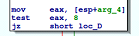
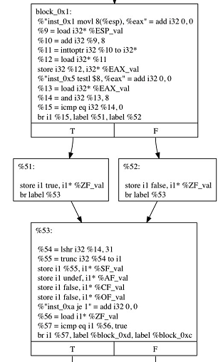
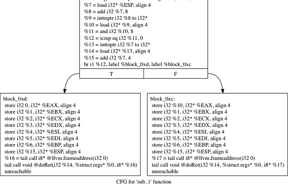

# Architecture

The translator is broken into two components: control flow recovery and translation. These components are two separate applications and can operate independently of each other. In typical usage, a program's control flow graph (CFG) is recovered and then the CFG is immediately transcribed into LLVM. The generated LLVM preserves the semantics of the source instructions with regards to their effects on memory, registers, and flags. 
     
## Control Flow Recovery

Control flow recovery is performed by a recursive descent work list driven algorithm that starts from an entry point and decodes blocks and functions. New function entry points are identified from branch, jump, and call instructions, and from relocations in the original program. The control flow graph recovery process does not attempt to perform block splitting, that is if a new block branches into the middle of an already-identified block, another copy of that block is created. 
 
Control flow recovery is the risky part of translation, because some elements are difficult to determine statically. For example, certain kinds of indirect branches that are not supported in this initial release. To determine the target of a branch such as `jmp <reg32>` would require either outside input from traces, or, some kind of iterative data flow analysis. While an interative analysis would be possible in this framework, it is not currently supported. 

### Conceptual Example

At this point in the translation, there is a block at address 0x8F that is branched to conditionally. 
 
Later in the translation, there is an unconditional branch that skips the statement at 0x8F. These are two separate locations in the native CFG produced by the translator, however in the original image they were identical locations. Tools like IDA represent this by staying close to what is in the program image and splitting a block. 
 
In IDAs representation, the block at 0x8F has had an implicit unconditional branch added to the CFG that branches to the block at 0x91. These two representations are identical and indicate the same semantic behavior, however it can lead to some confusion when comparing native CFGs produced by mcsema and CFGs produced by IDA.

## Instruction Translation

Native instructions operate on registers, memory, internal processors state, or some combination of the three. These instructions may perform complex operations with numerous side-effects. Each LLVM instruction, or statement, is pure and has no side effects. LLVM instructions may change either register state or memory state, but not both at once. Therefore, there is not a one-to-one mapping between native instructions and LLVM. During translation, each native instruction is translated into one or more LLVM instructions. 

Native processors have a limited number or registers and flags that represent processor state. LLVM has unlimited registers and no flags. To model native processors in LLVM, the translated instructions operate on a register context structure that models the native processor. 

Each function is given, as input, a structure that represents the current register context. Each function then has a prologue that will copy from the input state to local state. Every time control would transfer out of the function, local state is written back into the state structure and then either passed to return, or passed to child functions. 

This translation can be thought of as reducing each function into a series of statements in LLVM describing that functions effects on memory and registers. 

Every general-purpose register (GPR) on the supported platform is represented as a local variable of an integer type of the appropriate bit-width. Sub-registers (such as `ax`, `bx`, `cx`, `dx`, `ah`, `al`, etc) are not represented by their own variables. When a sub-register is read or written, bit-shifting operations are produced that will read or write the selected bits from each local variable. 

The inspiration behind representing registers as LLVM local variables is the memory to register transformation pass in LLVM. This pass can take code that has variables, in the form of locally allocated memory cells that are loaded from and stored to, and promotes those variables into SSA values. Once the code is in SSA form, common optimizations like merging, constant folding, and dead code elimination, can be used on the translated code.

These optimizations are beneficial to the translator because translating semantics is very noisy. To accurately represent each instruction, all of its side-effects must be represented as well. Many side effects are dead on arrival, commonly flag writes which are dominated by another flag write. It would be prohibitive for a translator to also maintain flow-sensitivity while translating, so instead, we have a very noisy first pass that emits every possible side effect and then use a standard compiler optimization to remove dead or meaningless side effects.

This has a few advantages and disadvantages. The chief disadvantage is that this does not represent stack-passed parameters in the LLVM. However, this information is lost during compilation from source language to native instructions and is only available by recovery and analysis of memory loads relative to the stack / base pointer. Since all of the semantics are captured by translation, it is conceivable that an analysis pass can consume the LLVM bitcode, discern parameter slots on the stack, and promote those into arguments that are passed to the function.

An advantage, related to parameter passing, is that this representation is capable of capturing parameter-passing schemes that use registers. Callers can use those schemes by simply writing the parameters into the appropriate register structure before calling the child function. 

 
### Conceptual Example

In its native form, shown here in IDA, assembly statements have many implicit effects on machine state in the form of setting flags. When we model it in LLVM, all effects are made explicit.

Here for example, there is branching behavior contained in the test instruction that is made explicit. The branch is sub-instruction, however our intermediate representation is sub-instruction so it makes sense to model it. 

Its worth pointing out here that in native code, there is a common idiom of flag sets being consumed by conditional branches. Since we've modeled the flags as individual variables, compiler optimizations can pick up on the linkage between flag setting instructions and flag consuming instructions and make the entire process very explicit, demonstrated in the following figure.

 
Here we can see that the flag behavior has been removed entirely, replaced with a conditional branch influenced by the test instruction. 

