# Things have gone wrong, now what

This document describes some approaches to debugging the lifted bitcode produced by McSema on Linux. This document does not describe [how to add missing instructions](https://github.com/lifting-bits/remill/blob/master/docs/ADD_AN_INSTRUCTION.md), or how to [resolve common errors](CommonErrors.md).

## Terminology

This document uses the term "original binary" to mean the binary that was disassembled using `mcsema-disass`. This document uses "native code" to mean machine code in the original binary.

This document uses the term "lifted code" to mean the binary and machine code produced by compiling the bitcode produced by `mcsema-lift`.

## Set yourself up for success

There are a few helpers for using GDB to debug lifted bitcode. Some setup before debugging is in order.

First, open up `~/.gdbinit`, add the below code to that file, and save it.

```gdb
set history filename ~/.gdb_history
set history save
set history size 4096
set pagination off
set auto-load safe-path /
set disassembly-flavor intel
set language c++
```

The `set pagination off` means that you won't always need to press Enter for GDB to print out more stuff. That gets annoying fast!

The `set auto-load safe-path /` tells GDB that it can open up a `.gdbinit` file anywhere. The McSema repository comes with a [`.gdbinit`](/.gdbinit) file, and so if you run `gdb` from within the root directory of the repository, then GDB will auto-load that file and its commands. If you do not trust this, then omit that line, and manually run `source /path/to/mcsema/.gdbinit` from within the GDB console.

The `set disassembly-flavor intel` tells GDB that it should disassemble instructions using Intel syntax, the one true syntax.

Finally, `set language c++` tells GDB that the source code that you will be debugging is C++. This is always a good option, because it's a good choice for both C and C++ debugging. GDB can usually do a pretty decent job with things like C++ standard library container data structures.

## Take stock of what's available

There are opportunities and drawbacks to debugging lifted code.

### Drawbacks

* Lifted code is more verbose than native code. An instruction from the original binary may be represented by tens of instructions in the lifted code.
* Lifted code does not contain the useful debug information that may allow one to view the source code associated with some bits of machine code.

### Opportunities

* The [`State`](https://github.com/lifting-bits/remill/blob/master/remill/Arch/X86/Runtime/State.h) is stored in memory. The advantage to this is that one can set data breakpoints (hardware watchpoints) on individual registers in the state structure. This is incredibly useful if you have a [time-travelling debugger](http://undo.io/products/undodb/).
* Lifted bitcode can be instrumented using the LLVM toolchain. Some useful-for-debugging instrumentations come built-in to `mcsema-lift`.

#### Built-in instrumentation

`mcsema-lift` comes with two useful instrumentations that can help during debugging: `--add_breakpoints` and `--add_reg_tracer`.

### Breakpoint functions with `--add_breakpoints`

One of the aforementioned drawbacks when trying to debug lifted code is that it is more verbose. This verbosity makes things hard if you're trying to debug the translation of a specific instruction in the original binary, or if you're trying to pause execution at a specific spot.

That is why there is the `--add_breakpoints` option. The idea is that, just as you can say `b *0x402a00` to set a breakpoint on an instruction in the original binary, you can also do `b breakpoint_402a00` to set a breakpoint on the location of an "original instruction", but in the lifted binary.

|               Native code                | Lifted code with breakpoint functions |
| :--------------------------------------: | :-----------------------------------: |
| 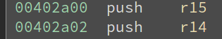 | 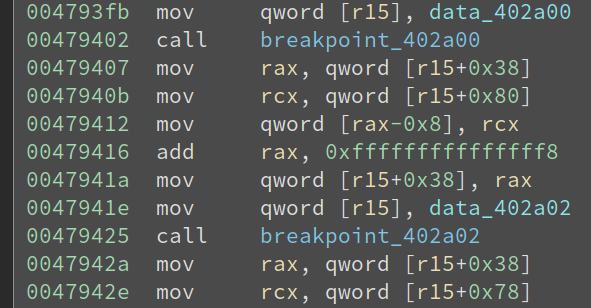 |

On the left we see two instructions from the native code. On the right, we see the lifted code associated with the first and part of the second native instruction. Interspersed between the two are the `breakpoint_` functions. These breakpoint functions are "serializing" instructions. We can be certain that the `State` structure is in a consistent state at each call to a `breakpoint_` function. That is, the contents of the `State` struct at `breakpoint_402a00` in the lifted code should mostly match the native register state at `0x402a00` in the original binary.

#### Example

Here's an example of using the `print-reg-state-amd64` GDB command in conjunction with the breakpoint feature. There are `-x86` and `-aarch64` variants of `print-reg-state` as well.

First, we set a breakpoint at `breakpoint_402a00` in `/tmp/ls_lifted`. The lifted state at this point will correspond to the native state at `0x402a00` in `/bin/ls`.

```gdb
(gdb) b breakpoint_402a00
Breakpoint 1 at 0x4f9160
```

Second, run the program until the breakpoint is hit.

```gdb
(gdb) r
Starting program: /tmp/ls_lifted
[Thread debugging using libthread_db enabled]
Using host libthread_db library "/lib/x86_64-linux-gnu/libthread_db.so.1".
Breakpoint 1, 0x00000000004f9160 in breakpoint_402a00 ()
```

We're now stopped at the `breakpoint_402a00` and can inspect the values of the `State` structure.

```gdb
(gdb) print-reg-state-amd64
             emulated                   native
rip     0x0000000000402a00        0x00000000004f9160
rax     0x000000000040399d        0x000000000040399d
rbx     0x0000000000000000        0x8000000000000000
rcx     0x0000000000000000        0x0000000000000000
rdx     0x00007fffffffddb8        0x00007fffffffddb8
rsi     0x00007fffffffdda8        0x00007fffffffdda8
rdi     0x0000000000000001        0x00007ffff7ebb810
rbp     0x0000000000515620        0x00007ffff7fbba30
rsp     0x00007fffffffdcc8        0x00007ffff7fbb978
r8      0x0000000000515690        0x0000000000515690
r9      0x00007ffff7de78e0        0x00007ffff7de78e0
r10     0x0000000000000846        0x0000000000000846
r11     0x00007ffff717b740        0x00007ffff717b740
r12     0x0000000000402670        0x0000000000402670
r13     0x00007fffffffdda0        0xde7accccde7acccc
r14     0x0000000000000000        0x0000000000000000
r15     0x0000000000000000        0x00007ffff7ebb810
(gdb)
```

Here, lets go see what things look like in the original `/bin/ls` program at the same place.

```gdb
(gdb) b *0x402a00
Breakpoint 1 at 0x402a00
(gdb) r
Starting program: /bin/ls
[Thread debugging using libthread_db enabled]
Using host libthread_db library "/lib/x86_64-linux-gnu/libthread_db.so.1".

Breakpoint 1, 0x0000000000402a00 in ?? ()
(gdb) info reg
rax            0x402a00 4205056
rbx            0x0  0
rcx            0x0  0
rdx            0x7fffffffddb8 140737488346552
rsi            0x7fffffffdda8 140737488346536
rdi            0x1  1
rbp            0x413be0 0x413be0
rsp            0x7fffffffdcc8 0x7fffffffdcc8
r8             0x413c50 4275280
r9             0x7ffff7de78e0 140737351940320
r10            0x846  2118
r11            0x7ffff780c740 140737345800000
r12            0x4049a0 4213152
r13            0x7fffffffdda0 140737488346528
r14            0x0  0
r15            0x0  0
rip            0x402a00 0x402a00
```

Things won't perfectly match up, especially near the beginning of the execution (`402a00` is the entrypoint of the `main` function). Nonetheless, the *essential* parts will match up -- those that affect later computations and control-flow.

This is a nifty way of visually seeing if things match up with your expectations. Though, not everything is printed out at this point. For example, if you're observing that lifted execution goes one way, while native execution goes the other, then you may want to inspect the `EFLAGS` register to see what's going on. There's a command for that too!

```gdb
(gdb) print-flags-amd64
eflags [PF AF ZF ]
```

#### Advanced usage

This part depends on you having a reversible debugger. Some options are [UndoDB](http://undo.io/products/undodb/), [Mozilla rr](https://github.com/mozilla/rr), or using the plain-old (and slow) [GDB reverse debugger](https://www.gnu.org/software/gdb/news/reversible.html) (there is also some Valgrind support for this).

The below example is based on using UndoDB. This example is contrived, but shows of a successful workflow for hunting down bugs.

Let's say we're in `sub_40eca0` and we want to know who initializes the value of first argument, stored in register `rdi`. We can see from the picture on the right that the function `sub_40eca0` is called from many places.

|        Function `sub_40eca0` using `rdi` | Callers of `sub_40eca0`                  |
| ---------------------------------------: | :--------------------------------------- |
| 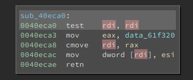 | 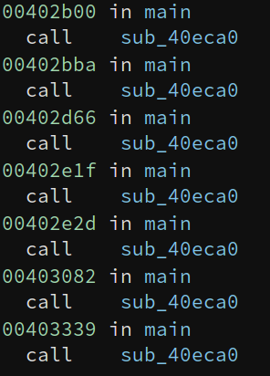 |

Now we get to take advantage of one of our opportunities: we can set data breakpoints on registers in the `State` structure! Let's go find the source of `rdi` given a call to `sub_40eca0`.

First, we get the address of `rdi` within the `State` structure.

```gdb
(gdb) addr-of-rdi
&rdi = 0x00007ffff7ebb840
```

Then, we set a hardware watchpoint, and reverse-execute.

```gdb
(undodb-gdb) reverse-continue
Continuing.
Hardware watchpoint 1: *0x00007f0334483840

Old value = -1878107376
New value = 32207024
0x00000000004d27eb in sub_40eca0 ()
```

Great! You can now investigate the register state here with `print-reg-state-amd64`, and potentially work your way back by setting more watchpoints. It's useful to coordinate this workflow with IDA Pro or Binary Ninja to visually see where you are.

One reason why this approach can be successful is that it can be applied from where the bug occurs, and used to work back from there. This example was contrived; a better solution would have been to look at a backtrace on entry to `sub_40eca0` to see who the caller is. This technique is more effectively applied when working backward through complex control flows.

### Register tracing with `--add_reg_tracer`

A second option to `mcsema-lift` is `--add_reg_tracer`. This will inject function calls before every lifted instruction (similar to `--add_breakpoints`). The called function prints out the values of the general purpose registers stored in the `State` structure.

#### Collecting lifted traces

The first step to collecting a trace is to disassemble and lift a program. Our program of choice is `/bin/ls`. There is a bug in the lifted code when we run the lifted program with the `--recursive` option, and we're going to diagnose it.

First, disassemble the program.

```shell
mcsema-disass --arch amd64 --os linux --disassembler /opt/ida-6.9/idal64 --output /tmp/ls.cfg --binary /bin/ls --log_file /dev/stderr --entrypoint main
```

Then, lift it, adding in the `--add_reg_tracer` option.

```shell
mcsema-lift-3.0 --arch amd64 --os linux --cfg /tmp/ls.cfg --output /tmp/ls.bc --entrypoint main --add_reg_tracer
```

Finally, compile it back to a program.

```shell
remill-clang-3.8 -O3 -o /tmp/ls_lifted /home/pag/Code/mcsema/lib/libmcsema_rt64-3.8.a /tmp/ls.bc -lpthread -ldl -lpcre /lib/x86_64-linux-gnu/libselinux.so.1
```

Now we can run it and see an example of the output.

```shell
pag@sloth:~/Code/mcsema/tools/regtrace$ /tmp/ls_lifted --recursive
RIP=402a00 RAX=4039ed RBX=0 RCX=0 RDX=7fffc67546b0 RSI=7fffc6754698 RDI=2 RSP=7fffc67545b8 RBP=4e9b60 R8=4e9bd0 R9=7f0bc4b178e0 R10=846 R11=7f0bc3eab740 R12=4026c0 R13=7fffc6754690 R14=0 R15=0
RIP=402a02 RAX=4039ed RBX=0 RCX=0 RDX=7fffc67546b0 RSI=7fffc6754698 RDI=2 RSP=7fffc67545b0 RBP=4e9b60 R8=4e9bd0 R9=7f0bc4b178e0 R10=846 R11=7f0bc3eab740 R12=4026c0 R13=7fffc6754690 R14=0 R15=0
...
Segmentation fault
```

Great, we can see the bug mentioned above: the execution halts at a segmentation fault. The other thing we can see is that the output is quite verbose! The produced output lets you see, at an instruction granularity, how the register state changes. It's especially useful as a way of debugging control-flow divergences between what should have happened in the original binary, versus what did happen in the lifted binary.

Let's make a copy of this trace for later.

```shell
/tmp/ls_lifted --recursive >/tmp/lifted_trace
Segmentation fault
```

So we have a trace of the lifted program, and we'd like to discover where it diverges relative to the original program. What do we do?

#### Collecting native traces with PIN

One way to drill down on divergences is by comparing the lifted trace with a ground truth: a trace recorded from a native program execution. We can do this with the [`regtrace` PIN tool](/mcsema/tools/regtrace/README.md). The first step is to [download and install PIN](https://software.intel.com/en-us/articles/pintool-downloads) before we can use the PIN tool.

The next step to using the PIN tool is to build it!

```shell
cd tools/regtrace
export PIN_ROOT=/opt/pin-3.2-81205-gcc-linux/
./build.sh
```

Then we'll run it and collect a trace.

```shell
${PIN_ROOT}/pin -t obj-intel64/Trace.so -entrypoint 0x402a00 -- /bin/ls --recursive >/tmp/native_trace
```

Note that the address `0x402a00` passed to `-entrypoint` is the address of `main` in the original binary. We specified `main` as the entrypoint to the program when disassembled and lifted it.

Now we've got the two traces and so we can diff them to drill down on discovering the divergence.

There are a few gotchas when comparing traces.

##### Gotcha #1: External calls

The first gotcha is calls to externals, like `strlen`. In native code, there will be a call to a stub function that goes to `strlen`. The lifted code will not have lifted these stubs, and so will not emulate the instructions of the stubs. The effect is that there will be extra instructions printed out from the `regtrace` tool that are absent from the lifted code.

##### Gotcha #2: Spurious differences

The second gotcha is spurious differences between the traces. There are likely to be a lot of these, especially when the original binary calls out to a shared library, and then execution returns back into the original binary. Many register values on return from the library code, but in the lifted program, will have different values that what is recorded by `regtrace`.

Another example of spurious differences relate to `REP`-prefixed instructions. The first example is repeated string instructions, e.g. `rep stos`. In a native trace, each repeated iteration will produce a single line of output. In the lifted trace, there will only be one line. The second example is `repz ret`. This can show up as two distinct instructions in the lifted trace, but only one in the native trace.

##### Gotcha #3: Huge traces

The final gotcha is huge traces. It is often useful to narrow the scope of what is diffed. This gotcha is exacerbated by the issue of spurious differences. In general, a good starting point is to take the trace, and chop out the sequence of program counters only. This will let us find a first point of non-spurious divergence, and then we can work back from there using more of the information available in the trace.

We can chop out the sequence of instruction pointers as follows:

```shell
grep -oP '^[ER]IP[^ ]+' /tmp/native_trace > /tmp/native_pc_trace
```

#### Analyzing the traces

Our current example produces a segmentation fault when running `/tmp/lifted_ls --recursive`, but this happens after some file information is printed. The traces that we record are huge, so we will start by focusing only on the sequence of `RIP` values printed out, then work back from there.

```shell
pag@sloth:~/Code/mcsema/tools/regtrace$ grep -oP '^[ER]IP[^ ]+' /tmp/native_trace > /tmp/native_pc_trace
pag@sloth:~/Code/mcsema/tools/regtrace$ grep -oP '^[ER]IP[^ ]+' /tmp/lifted_trace > /tmp/lifted_pc_trace
```

I use Meld Diff Viewer, so what I usually look for in the diff is the blue sections (minor differences) in the diff. Here's what I see for this issue.

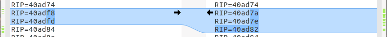
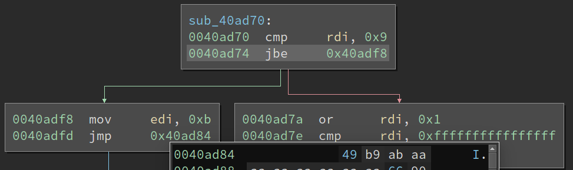

So what we see above is that there is a `jbe 0x40adf8`, and in the lifted code, it goes down the taken path to `0x40adf8`, whereas the native code goes down the not-taken path to `0x40ad7a`.

First, we'll lift a second copy of this binary using the `--add_breakpoints` option and not the `--add_reg_tracer`. Then we'll whip open the debugger and try to figure out this issue.

```shell
pag@sloth:~/Code/mcsema/build$ undodb-gdb /tmp/ls_lifted_bp
...
(undodb-gdb) source /home/pag/Code/mcsema/.gdbinit
(undodb-gdb) b breakpoint_40ad74
Breakpoint 1 at 0x4f0fc0
(undodb-gdb) r --recursive
...

Breakpoint 1, 0x00000000004f0fc0 in breakpoint_40ad74 ()
(undodb-gdb) print-flags-amd64
eflags [CF AF SF ]
```

Alright, in the lifted code we see that the `EFLAGS` at the point of the `jbe` are `CF`, `AF`, and `SF`. Here's what the manual has to say on what conditions must be set for `jbe` to follow the taken path:

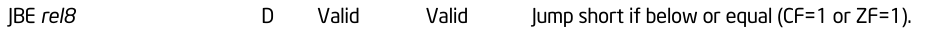

This explains why the lifted execution follows the taken path; the `CF` (carry flag) is set in the lifted code. Let's see what the native execution looks like:

```shell
pag@sloth:~/Code/mcsema/build$ undodb-gdb /bin/ls
...
(undodb-gdb) b *0x40ad74
Breakpoint 1 at 0x40ad74
(undodb-gdb) r --recursive
...
Breakpoint 1, 0x000000000040ad74 in ?? ()
(undodb-gdb) info reg
...
rip            0x40ad74 0x40ad74
eflags         0x212  [ AF IF ]
...
```

Ignore the `IF`, that's the interrupt flag, and it will always be set unless we're debugging kernel space code where interrupts are disabled (e.g. in an interrupt handler). The `AF` flag (auxiliary carry flag) is set in both traces, but that's the only common thing. Time to work backwards to see why `CF` is set in the lifted trace and not in the native trace.

The instruction just before the `jbe` at `0x40ad74` is a `cmp rdi, 0x9`. This instruction will modify the flags, so lets look in our extended traces and see what the value of `rdi` is in both traces.

```shell
pag@sloth:~/Code/mcsema/tools/regtrace$ grep 'RIP=40ad74' /tmp/lifted_trace
RIP=40ad74 ... RDI=0 ...
pag@sloth:~/Code/mcsema/tools/regtrace$ grep 'RIP=40ad74' /tmp/native_trace
RIP=40ad74 ... RDI=25 ...
```

So, the value of `RDI` should be `0x25` but instead it is `0x0`. We can step back slightly through the program counter trace and see that `sub_40ad70` is called in the block starting at `0x40b62b` (shown below).

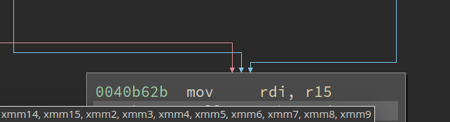

The value of `RDI` comes from `R15`, but unfortunately there's a lot of predecessors. We can deal with this by working backward through our trace, figuring out the location of the last assignment to `R15`. I'm going to cheat and use reverse execution.

```gdb
(undodb-gdb) addr-of-r15
&r15 = 0x00007f8d4ff1d890
(undodb-gdb) watch *0x00007f8d4ff1d890
Hardware watchpoint 2: *0x00007f8d4ff1d890
(undodb-gdb) reverse-continue
Continuing.
Hardware watchpoint 2: *0x00007f8d4ff1d890

Old value = 0
New value = 30
0x00000000004c4c26 in sub_40B5B0 ()
(undodb-gdb) print-reg-state-amd64
             emulated                   native
rip     0x000000000040b710        0x00000000004c4c26
...
(undodb-gdb) addr-of-xmm0
&xmm0 = 0x00007f8d4ff1d940
(undodb-gdb) x/4f 0x00007f8d4ff1d940
0x7f8d4ff1d940: 0 0 0 0
```

This tells us that the value of `R15` was changed at instruction `0x40b710`, shown below.

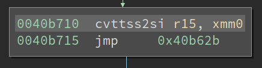

The `cvttss2si` instruction is pretty complicated. Let's see what should have happened in the native execution.

```gdb
(undodb-gdb) b *0x40b710
Breakpoint 2 at 0x40b710
(undodb-gdb) reverse-continue
Continuing.

Breakpoint 2, 0x000000000040b710 in ?? ()
(undodb-gdb) x/i $pc
=> 0x40b710:  cvttss2si r15,xmm0
(undodb-gdb) p/x $r15
$1 = 0x1e
(undodb-gdb) p $xmm0
$2 = {v4_float = {37.5, 0, 0, 0}, ...}
```

Looks like we can see a difference in the values of `XMM0` compared. In the lifted trace, the first float is a `0`, but in the native trace, the value is `37.5`, which converted to an integer is `0x25`. We're going to need to work backward again.

```gdb
(undodb-gdb) addr-of-xmm0-64
&xmm0 = 0x00007f8d4ff1d940
(undodb-gdb) watch *0x00007f8d4ff1d940
Hardware watchpoint 3: *0x00007f8d4ff1d940
(undodb-gdb) reverse-continue
Continuing.
Hardware watchpoint 3: *0x00007f8d4ff1d940

Old value = 0
New value = -16777216
__mcsema_attach_ret () at runtime_64.S:80
80    movdqu fs:[__mcsema_reg_state@TPOFF + 304], xmm0
Warning: the current language does not match this frame.
(undodb-gdb) print-reg-state-64
             emulated                   native
rip     0x0000000000402190        0x0000000000514ea6
...
```

Oof. We've found ourselves in one of the attach/detach routines (`__mcsema_attach_ret`) for transitioning between lifted code and native code. These routines are tricky.

When we see an `__mcsema_attach_ret`, what it's really meaning is that at some earlier point, lifted code called into some native library code. This lifted-to-native transition happens via the `__mcsema_detach_call` or `__mcsema_detach_call_value` functions. Eventually that native code needs to transition back to lifted code. This is achieved by setting up a special return address on the stack, `__mcsema_attach_ret`. When native code returns, it returns to `__mcsema_attach_ret`, which marshals native register state back into the `State` structure, and continues on in lifted code.

Alright, lets step back and attack this problem from the native side. Looking back at our control-flow graph, we can see that `XMM0` is modified by a `divss` instruction.

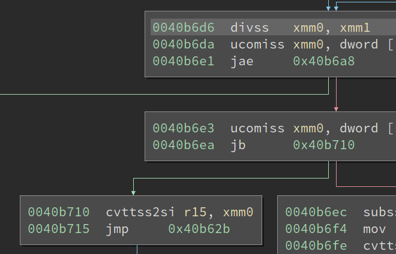

Let's confirm that the `divss` instruction at `0x40b6d6` is really the source of the `37.5` number.

```gdb
(undodb-gdb) b *0x40b6d6
Breakpoint 3 at 0x40b6d6
(undodb-gdb) reverse-continue
Continuing.

Breakpoint 3, 0x000000000040b6d6 in ?? ()
(undodb-gdb) p $xmm0.v4_float
$5 = {30, 0, 0, 0}
(undodb-gdb) p $xmm1.v4_float
$6 = {0.800000012, 0, 0, 0}
(undodb-gdb) p 30 / 0.800000012
$7 = 37.499999437500009
```

Yup, it is. Our reverse-execution based on a watchpoint on `&(State::XMM0)` led us astray. Lets go back to the breakpoint approach, and see what things look like at `breakpoint_40b6d6`.

```gdb
(undodb-gdb) c
Continuing.

Breakpoint 1, 0x00000000004f0fc0 in breakpoint_40ad74 ()
undodb-gdb: Have switched to record mode.
(undodb-gdb) b *breakpoint_40b6d6
Breakpoint 4 at 0x50f6c0
(undodb-gdb) reverse-continue
Continuing.

Breakpoint 4, 0x000000000050f6c0 in breakpoint_40b6d6 ()
...
(undodb-gdb) addr-of-xmm0
&xmm0 = 0x00007f8d4ff1d940
(undodb-gdb) addr-of-xmm1
&xmm1 = 0x00007f8d4ff1d950
(undodb-gdb) x/f 0x00007f8d4ff1d940
0x7f8d4ff1d940: 0
(undodb-gdb) x/f 0x00007f8d4ff1d940
0x7f8d4ff1d940: 0
(undodb-gdb) x/f 0x00007f8d4ff1d950
0x7f8d4ff1d950: 0.800000012
```

So this is sort of encouraging. `XMM1` contains the correct value of `0.800000012` but `XMM0` is off at this point. Let's use our trace to find the last source of `XMM0`.

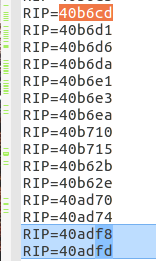 | 

OK we're in business. The `pxor xmm0, xmm0` clears out the `XMM0` register, then the `cvtsi2ss` converts `R15` into a `float`, and stores it into `XMM0`. Lets step back to the `cvtsi2ss` and compare lifted to native.

```gdb
(undodb-gdb) b breakpoint_40b6d1
Breakpoint 6 at 0x50f6b0
(undodb-gdb) reverse-continue
Continuing.

Breakpoint 6, 0x000000000050f6b0 in breakpoint_40b6d1 ()
(undodb-gdb) print-reg-state-64
             emulated                   native
...
r15     0x000000000000001e        0xde7accccde7acccc
```

And in the native code.

```gdb
(undodb-gdb) b *0x40b6d1
Breakpoint 4 at 0x40b6d1
(undodb-gdb) reverse-continue
Continuing.

Breakpoint 4, 0x000000000040b6d1 in ?? ()
(undodb-gdb) info reg
...
r15            0x1e 30
...
```

Amazing! The `State::R15` in the lifted code and `R15` in the native code match up. This tells us that there is a bug in the semantics of `cvtsi2ss`! Alright, what does this instruction even do?

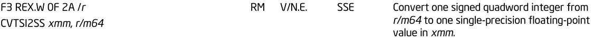

So, it will take a signed integer in `R15`, convert it into a `float`, and store that into the low 4 bytes of `XMM0`, zeroing out the other 12 bytes in `XMM0`. What is our lifted code doing?

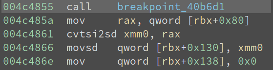

What we're seeing here is that `R15` is converted into a `double`, then storing that to the low 8 bytes of `XMM0`, then clearing out the high 8 bytes of `XMM0`. This doesn't sound right! Let's confirm that this is indeed what is happening.

```gdb
(undodb-gdb) b *0x4c4879
Breakpoint 7 at 0x4c4879
(undodb-gdb) c
Continuing.

Breakpoint 7, 0x00000000004c4879 in sub_40B5B0 ()
(undodb-gdb) addr-of-xmm0
&(State::xmm0) = 0x00007f8d4ff1d940
(undodb-gdb) p *(double *)0x00007f8d4ff1d940
$4 = 30
```

Alright, we have confirmation, the lifted code for `cvtsi2ss` is definitely doing the wrong thing. Time to see the C++ code implementing this instruction.

**NOTE:** How McSema lifts instructions has changed since this walkthrough was originally written. The remainder of this document has been preserved for posterity. Instruction semantics are no longer implemented within McSema, and are instead implemented (and tested) in the [Remill](https://github.com/lifting-bits/remill) project.

First, we'll figure out what LLVM opcode implements this instruction.

```shell
pag@sloth:~/Code/mcsema/build$ echo "cvtsi2ss xmm0, r15" | llvm-mc-3.8 -x86-asm-syntax=intel -show-inst
  .text
  cvtsi2ssq %r15, %xmm0     # <MCInst #670 CVTSI2SS64rr
                            #  <MCOperand Reg:126>
                            #  <MCOperand Reg:117>>
```

We can find the instruction dispatcher for this function in [SSE semantics code](/mcsema/Arch/X86/Semantics/SSE.cpp).

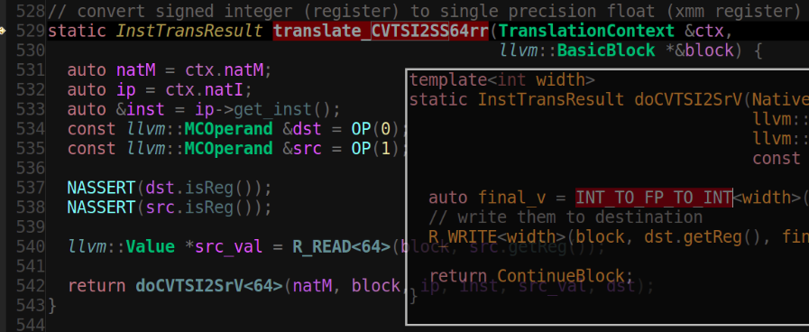

We can also disassemble (using `llvm-dis-3.8`) the lifted bitcode file and look directly at the LLVM IR to see what is produced.

```llvm
  call void @breakpoint_40b6d1(%Memory *%memory, %State* %0, i64 %pc), !mcsema_real_eip !14434
  %665 = load i64, i64* %R15_read, !mcsema_real_eip !14434
  %666 = sitofp i64 %665 to double, !mcsema_real_eip !14434
  %667 = bitcast double %666 to i64, !mcsema_real_eip !14434
  %668 = zext i64 %667 to i128, !mcsema_real_eip !14434
  store volatile i128 %668, i128* %XMM0_write, !mcsema_real_eip !14434
  br label %block_40b6d6, !mcsema_real_eip !14435
```

What we are seeing is that the semantics function `translate_CVTSI2SS64rr` is using `64` for target floating point width when calling `doCVTSI2SrV`. The `doCVTSI2SrV` function

 1. Calls the `INT_TO_FP_TO_INT<64>` helper function with the value of `R15`.
 2. `INT_TO_FP_TO_INT<64>` converts `R15` to a `width`-sized floating point number (in our case, a 64-bit float, i.e. a `double`).
 3. `INT_TO_FP_TO_INT<64>` reinterprets that value as an integer (without a format change).
 4. `doCVTSI2SrV` writes that 64-bit integer (containing a float) to `XMM0`, which zero extends the 64-bit integer into a 128-bit integer.

Clearly we should have called `doCVTSI2SrV<32>` instead of `doCVTSI2SrV<64>`, so that `INT_TO_FP_TO_INT<width=32>` would do a narrower conversion.

Let's make this change, rebuild and install McSema, re-run `mcsema-lift`, compile the new bitcode, and hope for the best. Here's what the new bitcode looks like after the fix:

```llvm
  call void @breakpoint_40b6d1(%Memory *memory, %State* %0, i64 %pc), !mcsema_real_eip !14434
  %665 = load i64, i64* %R15_read, !mcsema_real_eip !14434
  %666 = sitofp i64 %665 to float, !mcsema_real_eip !14434
  %667 = bitcast float %666 to i32, !mcsema_real_eip !14434
  %668 = zext i32 %667 to i128, !mcsema_real_eip !14434
  store volatile i128 %668, i128* %XMM0_write, !mcsema_real_eip !14434
  br label %block_40b6d6, !mcsema_real_eip !14435
```

#### Closing comments

This document presented a few of the helpful commands provided for debugging, and then walked through the diagnosis and fixing of a specific bug that was present in McSema at commit [409abe3d31a7b0d09b1fee9c60e1d190de39cced](https://github.com/lifting-bits/mcsema/commit/409abe3d31a7b0d09b1fee9c60e1d190de39cced).

There is a lot of information in this document. Despite this, the same techniques used in this document can be productively applied to may similar types of bugs.
