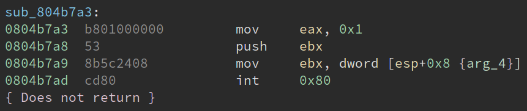

# Machine code to bitcode: the life of an instruction

This document describes how machine code instructions are lifted into LLVM bitcode. It should provide a detailed, inside-out overview of how McSema performs binary translation. This document omits some important steps, so consulting the [Navigating the code](NavigatingTheCode.md) document will be helpful.

## Running example

This document will use the instructions in the following basic block as a running example.



## Step 1: CFG protocol buffer representation

The first step to lifting involves getting the machine code instructions of some binary file into a format the McSema understands. These files are generated with the help of external tools for program disassembly (IDA Pro) so that McSema doesn't need to understand the many executable file formats.

The file format used by McSema is a [CFG protocol buffer](/mcsema/CFG/CFG.proto). This file is produced using the [`mcsema-disass`](/mcsema/tools/mcsema_disass) tool. The CFG file for the above code block contains the following data.

```protobuf
Module {
  funcs = [
    Function {
      ea = 0x804b7a3;
      blocks = [
          Block {
            ea = 0x804b7a3;
            block_follows = [ ];
            insts = [

              // mov    eax, 0x1
              Instruction {
                ea = 0x804b7a3;
                bytes = "\xb8\x01\x00\x00\x00";
              },

              // push   ebx
              Instruction {
                ea = 0x0804b7a8;
                bytes = "\x53";
              },

              // mov    ebx, dword [esp+0x8]
              Instruction {
                ea = 0x0804b7a9;
                bytes = "\x8b\x5c\x24\x08";
              },

              // int    0x80
              Instruction {
                ea = 0x0804b7ad;
                bytes = "\xcd\x80";
                local_noreturn = true;
              } ];
          } ];
    } ];
  ...
}
```

## Step 2: Lifting to bitcode

The second step, which is really a few steps, is to decode the CFG file and produce one LLVM bitcode function for every `Function` message into the CFG file. Below is a portion of the bitcode produced for the above function.

```llvm
; Function Attrs: noinline
define void @sub_804b7a3(%struct.State* dereferenceable(2688) %state2, i32 %pc, %struct.Memory* %memory1) #2 {
block_804b7a3:
  %0 = getelementptr inbounds %struct.State, %struct.State* %state2, i32 0, i32 6, i32 33, i32 0, i32 0
  %1 = getelementptr inbounds %struct.State, %struct.State* %state2, i32 0, i32 6, i32 1, i32 0, i32 0
  %2 = getelementptr inbounds %struct.State, %struct.State* %state2, i32 0, i32 6, i32 3, i32 0, i32 0
  %3 = getelementptr inbounds %struct.State, %struct.State* %state2, i32 0, i32 6, i32 13, i32 0, i32 0
  store i32 1, i32* %1        ; Move 1 into EAX
  %4 = load i32, i32* %2      ; Load EBX
  %5 = load i32, i32* %3      ; Load ESP
  %6 = add i32 %5, -4         ; Subtract 4 from ESP
  %7 = inttoptr i32 %6 to i32*; Cast ESP - 4 into a pointer
  store i32 %4, i32* %7       ; Store EBX into [ESP - 4]
  store i32 %6, i32* %3       ; ESP = ESP - 4  (complete the PUSH).
  %8 = add i32 %5, 4          ; Compute ESP + 8, (pre-decrement ESP + 4)
  %9 = inttoptr i32 %8 to i32*; Cast ESP + 8 into a pointer
  %10 = load i32, i32* %9     ; Load [ESP + 8]
  store i32 %10, i32* %2      ; Store [ESP + 8] into EBX
  %11 = add i32 %pc, 12       ; Increment the program counter by 12 bytes
  store i32 %11, i32* %0      ; Update EIP with the new program counter
  %12 = getelementptr inbounds %struct.State, %struct.State* %state2, i32 0, i32 0, i32 2
  store i32 128, i32* %12     ; Set the hyper call vector to 0x80
  %13 = getelementptr inbounds %struct.State, %struct.State* %state2, i32 0, i32 0, i32 0
  store i32 4, i32* %13       ; Set the hyper call number to kX86IntN

  ; Call the Remill `__remill_async_hyper_call` intrinsic function to
  ; model the system effects of the `int 0x80` interrupt instruction.
  %14 = tail call %struct.Memory* @__remill_async_hyper_call(%struct.State* nonnull %state2, i32 %11, %struct.Memory* %memory1)

  ret %struct.Memory* %14
}
```

The produced LLVM functions have a predictable structure. They are named according to the `ea` (effective address, or entry address) field in the `Function` message. The `ea` of our example function is `0x804b7a3`, and so the lifted function is named `sub_804b7a3`.

All lifted functions accept three arguments: a pointer to a [`State`](https://github.com/lifting-bits/remill/blob/master/remill/Arch/X86/Runtime/State.h#L520) structure, the current program counter, and an opaque pointer to a `Memory` structure. The lifted bitcode has a predictable structure. It emulates reads and writes of machine registers by using `load`s and `store`s to the `State` structure. It also emulates reads and writes to memory via `load`s and `store`s. To emulate memory differently, pass the `--keep_memops` option to `mcsema-lift-M.m`.

In this case, we see the use of some Remill intrinsic functions, but in practice those don't show up, because `int 0x80`s and their ilk are typically found in libraries that wrap system calls, and not directly in the binaries themselves.
